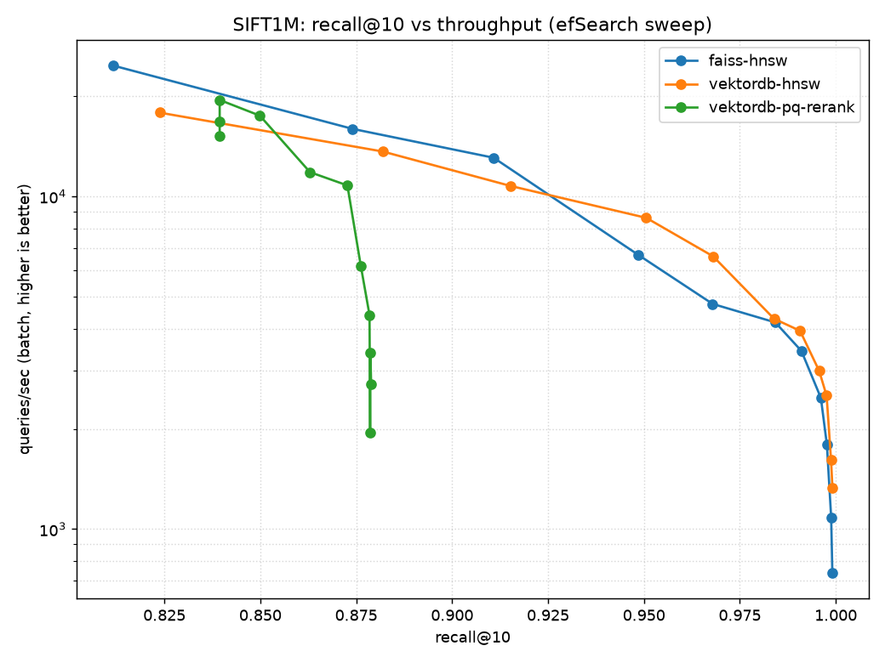
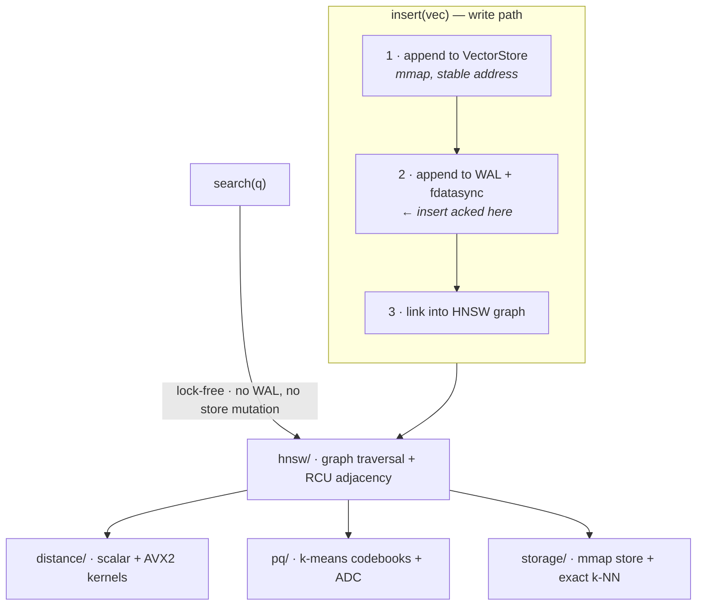

<h1 align="center">vektordb</h1>

<p align="center">
  A vector database written from first principles in Rust — HNSW graph, mmap storage,
  AVX2 kernels, product quantization and a write-ahead log, none of it a wrapper
  around an existing ANN library.
</p>

<p align="center">
  <a href="https://github.com/MaheshBhushan/vektordb/actions/workflows/ci.yml"></a>
  <a href="LICENSE"></a>
  
  
  
</p>

<p align="center">
  <a href="bench/RESULTS.md">Benchmark results</a> ·
  <a href="#design-decisions">Design notes</a> ·
  <a href="#quickstart">Quickstart</a> ·
  <a href="#citation">Cite</a>
</p>

<p align="center">
  
</p>

<p align="center">
  <sub>SIFT1M, 1M × 128-dim. Recall ties FAISS across the sweep; the curves cross
  around recall 0.925, after which vektordb carries more throughput at equal recall.
  <a href="bench/RESULTS.md">Method and full numbers →</a></sub>
</p>

## Overview

Most "build a vector DB" projects are a thin API over FAISS or hnswlib, which means
the interesting part — the retrieval infrastructure — is the dependency. This one
implements that layer and benchmarks the result against FAISS through an identical
harness. Three concerns meet in one artifact:

- **Algorithms** — HNSW from Malkov & Yashunin, including the Algorithm-4
  neighbor-selection heuristic and reciprocal-link pruning that recall depends on.
- **Systems** — mmap storage with permanently stable addresses, hand-written AVX2
  kernels with runtime dispatch, lock-free reads via epoch-based reclamation.
- **Databases** — WAL + `fdatasync` + checkpoints, torn-tail truncation, idempotent
  replay, and product quantization for budgets that don't fit the raw vectors.

## Quickstart

```sh
git clone https://github.com/MaheshBhushan/vektordb.git
cd vektordb
cargo test --workspace --release      # unit + property + stress + crash tests
```

Python, via the PyO3 bindings:

```sh
pip install maturin
cd vektordb-py && maturin develop --release
```

```python
import numpy as np, vektordb

db = vektordb.VektorDb("mydb", dim=128, m=16, ef_construction=200, durable=True)
db.add(np.random.rand(10_000, 128).astype(np.float32))   # returns count inserted

queries = np.random.rand(5, 128).astype(np.float32)
ids, dists = db.search(queries, k=10, ef=64)

db.train_pq(m=16)                                        # 32x compression
ids, dists = db.search_pq(queries, k=10, ef=64, rerank=4)
db.checkpoint()
```

Or the CLI, which doubles as the durability harness:

```sh
cargo run --release -p vektordb-cli -- ingest mydb 128 100000 10000
cargo run --release -p vektordb-cli -- search mydb 128 42 10
cargo run --release -p vektordb-cli -- verify mydb 128 100000
```

> [!NOTE]
> `durable=True` puts an `fdatasync` on the insert path — correct, and much slower.
> The benchmark runs with it off, as FAISS has no equivalent. AVX2 kernels are
> selected at runtime on x86-64; other architectures fall back to scalar and still
> build and pass tests.

## Results

SIFT1M, 1M × 128-dim base vectors, 10k queries, corpus ground truth. Both engines
driven through the same numpy arrays, ground truth, timing code and efSearch sweep
(`M=16`, `efConstruction=200`, L2).

| efSearch | vektordb recall@10 | FAISS recall@10 | vektordb QPS | FAISS QPS |
|---------:|-------------------:|----------------:|-------------:|----------:|
|       16 |             0.8237 |          0.8116 |       17,855 |    24,736 |
|       64 |             0.9680 |          0.9679 |        6,604 |     4,751 |
|      256 |             0.9976 |          0.9977 |        2,518 |     1,792 |
|      512 |             0.9991 |          0.9991 |        1,331 |       738 |

Recall is a dead heat. On throughput neither engine dominates: FAISS's leaner
per-query setup wins below ef≈48, and from ef=64 up — the range you run in for
0.97+ recall — vektordb is ahead, reaching 1.8× FAISS's QPS at ef=512. The PQ path
holds recall@10 ≈ 0.88 at 16 bytes per vector (32× compression) with re-ranking.

Full sweep, p50/p99 latencies, build times, the AVX2-vs-scalar kernel microbenchmark
and an explicit list of what is *not* being claimed: [`bench/RESULTS.md`](bench/RESULTS.md).

<details>
<summary>Reproduce the benchmark</summary>

```sh
cd bench
uv venv --python 3.12 .venv && source .venv/bin/activate   # or python -m venv
uv pip install -r requirements.txt
( cd ../vektordb-py && maturin develop --release )

python run.py --synthetic     # offline, 50k clustered vectors, ~1 min
python run.py                 # real SIFT1M, downloads ~500 MB once
python run.py --pq            # add the PQ curve
```

Numbers are machine-specific (8-core x86-64 with AVX2); the shape of the curves is
the point.
</details>

## Architecture



On disk, a database is a directory:

```
mydb/
  vectors.store   fixed-stride, 64-byte-aligned mmap of raw f32 vectors
  index.snap      HNSW checkpoint (temp+rename, CRC-checked)
  wal             append-only insert log since the last checkpoint
```

### Design decisions

- **mmap segments never move.** The store grows by mapping new doubling-sized
  segments rather than remapping one region, so a `&[f32]` handed to a reader stays
  valid for the life of the store even while other threads append and the file
  grows. This is what makes fully lock-free search possible.
- **RCU adjacency lists.** Each node's neighbor list is an immutable block behind a
  `crossbeam_epoch::Atomic`. Readers acquire-load the pointer; writers publish a
  replacement with a release store and retire the old block through the epoch
  collector. No reader ever takes a lock.
- **Deterministic level assignment.** HNSW level sampling is seeded from the vector
  id rather than entropy, so recovery rebuilds a byte-identical graph and the index
  is a pure function of `(data, insert order)`. This is what turned a flaky crash
  test into a reproducible one.

<details>
<summary><b>Durability and reachability are different contracts</b></summary>

The WAL guarantees every acked vector's *bytes* survive any crash. Graph
*reachability* is a property of the approximate index, not of durability: HNSW can
rarely leave a node with zero in-links ("unreachable point"), and this happens in
clean, never-crashed builds too — 7 nodes out of 1M, 0.0007%, in the SIFT1M run
above.

So the crash harness asserts durability strictly and treats the orphan rate as an
aggregate health metric. It does not pretend crashes cause the unreachable-point
property. Verified: 20 clean builds of 12k vectors produced zero orphans, and
recovery of the same data reproduces the same graph.
</details>

## Repository structure

```
vektordb-core/            the engine
  src/distance/           scalar + AVX2 L2/dot kernels, runtime dispatch
  src/storage/            mmap segment store, exact k-NN baseline
  src/hnsw/               graph, RCU concurrency, snapshot persistence
  src/pq/                 k-means codebooks, ADC search
  src/wal/                write-ahead log, replay, torn-tail truncation
  src/db.rs               the Db facade tying the layers together
vektordb-cli/             ingest / verify / search / orphans + crash harness
vektordb-py/              PyO3 bindings (maturin), used by the benchmark
bench/                    SIFT1M download, FAISS comparison, plots, RESULTS.md
```

Tests live next to the code they cover (`cargo test --workspace --release`), plus
`vektordb-cli/tests/crash.rs`, which SIGKILLs a live ingest at randomized points and
verifies every acked insert survives reopen. The concurrency stress test also runs
clean under ThreadSanitizer:

```sh
RUSTFLAGS="-Zsanitizer=thread" \
  cargo +nightly test -Zbuild-std --target x86_64-unknown-linux-gnu \
  -p vektordb-core --release --lib -- concurrent
```

## Status and scope

v1 is insert and search. Deletion is deliberately out of scope — robust HNSW
deletion is a research problem of its own — and PQ currently supports L2 only.
Not faster than FAISS everywhere, no GPU, no SIMD beyond AVX2, no int8/fp16 storage.

## Citation

```bibtex
@software{bhushan_vektordb,
  author = {Bhushan, Mahesh},
  title  = {vektordb: a vector database from first principles},
  url    = {https://github.com/MaheshBhushan/vektordb},
  year   = {2026}
}
```

The index follows Malkov & Yashunin, *Efficient and robust approximate nearest
neighbor search using Hierarchical Navigable Small World graphs*
([arXiv:1603.09320](https://arxiv.org/abs/1603.09320)). FAISS is the comparison
baseline, not a dependency.

## License

MIT — see [LICENSE](LICENSE).
